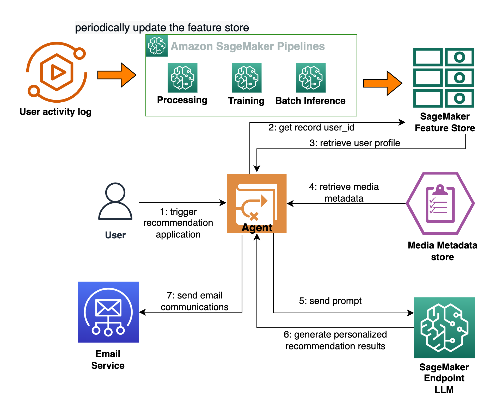

## Personalize your LLM applications with Amazon SageMaker Feature Store 

Let’s imagine a scenario where a movie entertainment company promotes movie tickets to different users via an email campaign. The promotion contains 25 well-known movies, and we want to select the top 3 recommendations for each user based on their interests and previous rating behavior.

For example, given a user's interest/ in different movie genres like Action, Romance, Sci-Fi, etc., we could have an AI system determine the top 3 recommended movies for that particular user. In addition, the system might generate personalized messages for each user in a tone tailored to their preferences. See examples of the personalized messages in the following sections. 

This AI application would include several components working together:

* A user profiling engine that takes in user previous behavior and outputs a user profile reflecting their interests.
* A feature store that maintains user profile data.
* A media metadata store that keeps the promotion movie list up-to-date.
* A language model that takes the current movie list, user profile data, and outputs the top 3 recommended movies for each user, written in a preferred tone.
* An orchestrating agent that coordinates the different components.

    

    

The application follows these steps to provide responses to one user’s recommendation:

* The user profiling engine that takes one user’s historical movie rating as the input, outputs user interest and stores the feature into Amazon SageMaker Feature Store, this process can be updated in a scheduling manner .
* The Agent takes user ID as the input, searching for the user interest and completing the prompt template following the user’s interests
* Agent takes the promotion item list (movie name description, genre) from a media metadata store. 
* The interests prompt template and promotion item list is fed into LLM for email campaign message 
* Agent sent the personalized email campaign to the end user.

    

To get started, please follow the [feature_store.ipynb](https://github.com/aws-samples/amazon-sagemaker-feature-store-with-llm/blob/main/feature_store.ipynb) for feature store data ingestion and fetching the user profile. Once setup, then [agent_chain.ipynb](https://github.com/aws-samples/amazon-sagemaker-feature-store-with-llm/blob/main/agent_chain.ipynb) provide the step-by-step walkthrough for our generative AI application. 

## License

This library is licensed under the MIT-0 License. See the LICENSE file.

